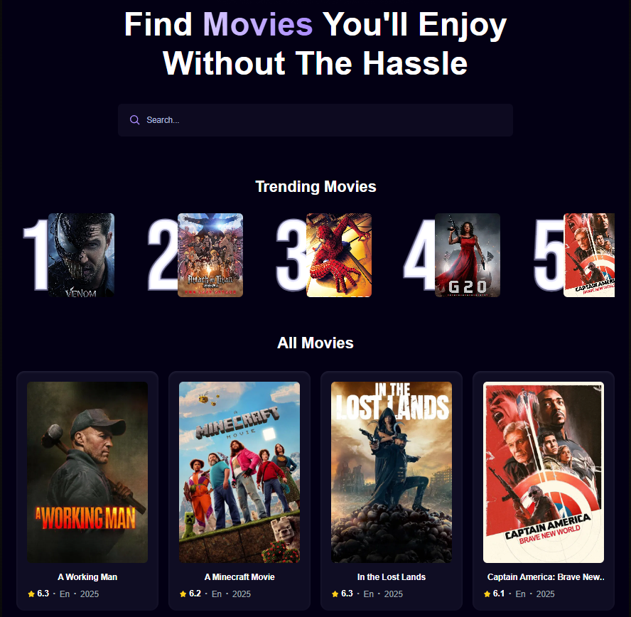

# ReactMovieAppwrite

A React app that fetches movies from [TMDb API](https://www.themoviedb.org/), uses [Appwrite](https://appwrite.io/) as the backend, and [Tailwind CSS](https://tailwindcss.com/) for styling. The app allows users to search for movies, and based on their search history, it shows the top 5 movie searches.

## Features

- Search for movies using the TMDb API
- Displays the top 5 most searched movies based on user search history
- Simple and responsive UI built with Tailwind CSS
- User authentication and database integration using Appwrite

## Screenshot

## Tech Stack

- **Frontend**: React + Vite
- **Styling**: Tailwind CSS
- **API**: TMDb API
- **Backend**: Appwrite (Authentication + Database)
- **State Management**: React Context API

## Prerequisites

- Node.js (v14 or higher)
- npm or yarn
- Appwrite account
- TMDb API key
